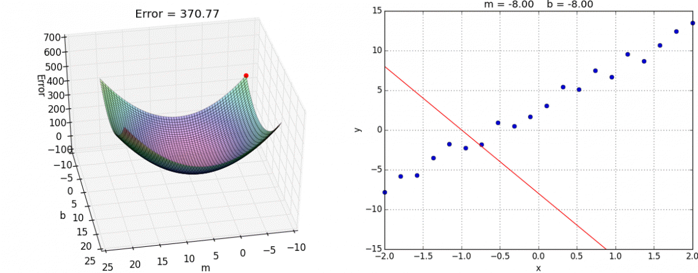

# Hi there! Welcome to my profile. 👋🏾

Image Source: https://alykhantejani.github.io/a-brief-introduction-to-gradient-descent/

My name is Fausto German. I graduated from the University of North Carolina at Charlotte with a B.S. in Computer Science. Currently, I am pursuing a Master of Science degree in Computer Science at Virginia Polytechnic Institute and State University (Virginia Tech), specializing in data science, machine learning, and interactive sensemaking. My primary interests revolve around multimodal deep learning and explainable A.I. (XAI).

> Imagination is more important than knowledge. For knowledge is limited, whereas imagination embraces the entire world, stimulating progress, giving birth to evolution.
>
> *Albert Einstein*

### Other Ways to Reach Me 🔗📬
Send me an <a href="mailto:faustotnc@gmail.com" target="_blank" rel="noopener">email</a> ✉️  
Find me on <a href="https://linkedin.com/in/fgerman" target="_blank" rel="noopener">LinkedIn</a> 👨🏽‍💼  
Visit my <a href="https://faustogerman.com" target="_blank" rel="noopener">personal website</a> 🌎 
Look at my pens on <a href="https://codepen.io/faustotnc" target="_blank" rel="noopener">CodePen</a> ✏️
